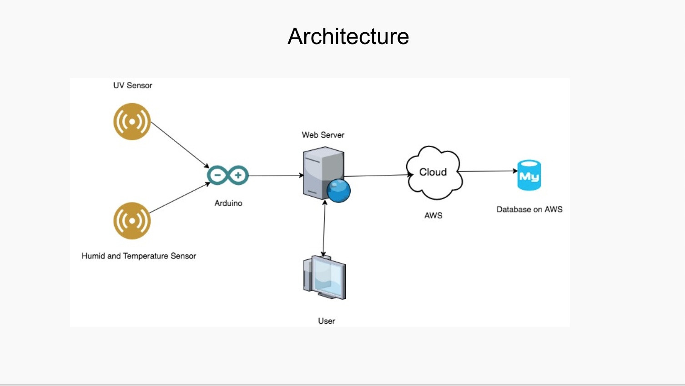

# SkinHealth Web Application #

Overview
The goal of this project is to build an electronic device by combining hardware and software, which can monitor the data of UV radiation, humidity and temperature in the environment, and give some useful suggestions to the users according their skin type. And this app is free for downloading.

Original Repository From Bitbucket: https://bitbucket.org/elec5622group04/elec5622       
Demo link: https://www.youtube.com/watch?v=7NtaR8CL4W8&feature=youtu.be

Aims   
1. To monitor and provide the real-time data about the UV radiation, humidity, and temperature in the environment.   
2. Give user suggestions based on the data that collected by sensors , and remind users when data is over alarm level.   
3. Generate reports of UV radiation, humidity, and temperature data every day for user history review.  

### How do I get set up? ###

Setup   
1. Clone project to local machine from https://github.com/Winton1992/SkinHealth.git
2. Download and finish relevant settings for Pycharm, AWS RDS.

(to log in AWS id: yili9196@uni.sydney.edu.au  password: ****** )

Git Workflow
Use the feature branch git workflow

Please do not work directly on the master branch. It must stay stable and working at all times. Consider submiting a pull request when you want to consolidate your feature branch into the master branch.

### Who do I talk to? ###

for more information, Contact: winton9219@gmail.com

